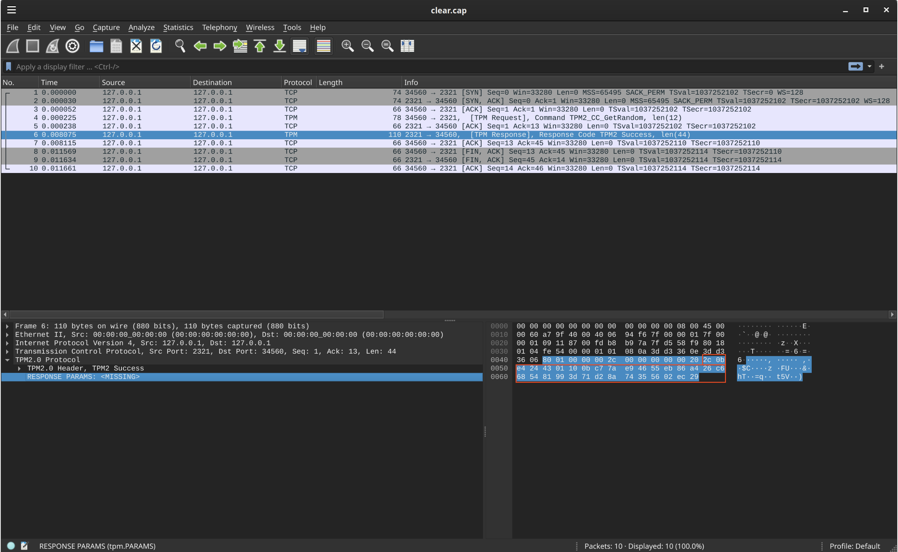
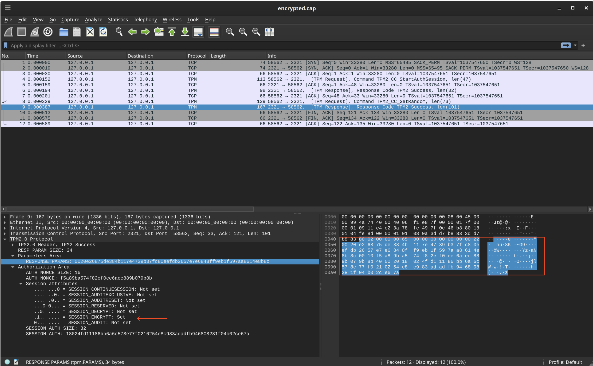

## TPM and PKCS-11 backed crypto/rand Reader   

A [crypto.rand](https://pkg.go.dev/crypto/rand) reader that uses a [Trusted Platform Module (TPM)](https://en.wikipedia.org/wiki/Trusted_Platform_Module) as the source of randomness.

Basically, its just a source of randomness used to create RSA keys or just get bits for use anywhere else.  With `tpm2-tools`, its like this:

```bash
$ tpm2_getrandom --hex 32 
   8c20c96c56d3ac200881ac86505020a0dafcfe0224fbc51b843e07625cc779fc
```

As background, the default rand generator with golang uses the following sources by default in [rand.go](https://go.dev/src/crypto/rand/rand.go)


The implementation uses go-tpm's [tpm2.GetRandom](https://pkg.go.dev/github.com/google/go-tpm/tpm2#GetRandom) function as the source of randomness from the hardware.


From there, the usage is simple:

```golang
package main

import (
	"crypto/rsa"
	"crypto/x509"
	"encoding/base64"
	"encoding/pem"
	"flag"
	"fmt"

	//"time"
	"github.com/google/go-tpm/tpmutil"
	//"github.com/cenkalti/backoff/v4"
	tpmrand "github.com/salrashid123/tpmrand"
)

var (
	tpmPath = flag.String("tpm-path", "/dev/tpm0", "Path to the TPM device (character device or a Unix socket).")
)

func main() {

	rwc, err := tpmutil.OpenTPM(*tpmPath)
	if err != nil {
		log.Fatalf("can't open TPM %q: %v", *tpmPath, err)
	}
	defer rwc.Close()

	randomBytes := make([]byte, 32)
	r, err := tpmrand.NewTPMRand(&tpmrand.Reader{
		TpmDevice: rwc,
		//Encrypted: true,
		//Scheme:    backoff.NewConstantBackOff(time.Millisecond * 10),
	})
	if err != nil {
		fmt.Printf("%v\n", err)
		return
	}
	// Rand read
	_, err = r.Read(randomBytes)
	if err != nil {
		fmt.Printf("%v\n", err)
		return
	}
	fmt.Printf("Random String :%s\n", base64.StdEncoding.EncodeToString(randomBytes))

	fmt.Println()

	// /// RSA keygen
	privkey, err := rsa.GenerateKey(r, 2048)
	if err != nil {
		fmt.Printf("%v\n", err)
		return
	}

	keyPEM := pem.EncodeToMemory(
		&pem.Block{
			Type:  "RSA PRIVATE KEY",
			Bytes: x509.MarshalPKCS1PrivateKey(privkey),
		},
	)
	fmt.Printf("RSA Key: \n%s\n", keyPEM)
}

```

### Encrypted Session

`tpmrand` also supports encrypted transports as described here:

- [CPU to TPM Bus Protection Guidance](https://trustedcomputinggroup.org/wp-content/uploads/TCG_CPU_TPM_Bus_Protection_Guidance_Passive_Attack_Mitigation_8May23-3.pdf)
- [Protecting Secrets At Tpm Interface](https://tpm2-software.github.io/2021/02/17/Protecting-secrets-at-TPM-interface.html)

Transport encryption is disabled by default so to enable, pass `Encrypted: true,` during initialization

for reference with `tpm2_tools`, you can find the test cases [here](https://github.com/tpm2-software/tpm2-tools/blob/master/test/integration/tests/getrandom.sh#L35)

As a demo, you see the TPM API calls [Using software TPM (swtpm) to trace API calls with TCPDump](https://github.com/salrashid123/tpm2/tree/master/simulator_swtpm_tcpdump)


```bash
## setup swtpm
mkdir /tmp/myvtpm
sudo swtpm socket --tpmstate dir=/tmp/myvtpm --tpm2 --server type=tcp,port=2321 --ctrl type=tcp,port=2322 --flags not-need-init,startup-clear
## start traces
sudo tcpdump -s0 -ilo -w encrypted.cap port 2321
```


Without encryption:

```bash
$ go run main.go  --tpm-path="127.0.0.1:2321"
    Random String :2c0be4244301100bc77ae94655eb86a426c6685481993d71d28a74355602ec29

```

note that the bytes returned is in the clear:




With encryption:

Then 
```bash
$ go run main.go  --tpm-path="127.0.0.1:2321"
   Random String :b9302b856c03466ec90e65f8c9817becab7e3e0a7523fabd7169607b2de55d60
```



---

While you're here, some other references on TPMs and usage:

* [Trusted Platform Module (TPM) recipes with tpm2_tools and go-tpm](https://github.com/salrashid123/tpm2)
* [golang-jwt for Trusted Platform Module (TPM)](https://github.com/salrashid123/golang-jwt-tpm)
* [golang-jwt for PKCS11](https://github.com/salrashid123/golang-jwt-pkcs11)
* [TPM Remote Attestation protocol using go-tpm and gRPC](https://github.com/salrashid123/go_tpm_remote_attestation)
* [crypto.Signer, implementations for Google Cloud KMS and Trusted Platform Modules](https://github.com/salrashid123/signer)

---

### PKCS-11

[ThalesIgnite crypto11.NewRandomReader()](https://pkg.go.dev/github.com/ThalesIgnite/crypto11#Context.NewRandomReader) is an alternative to this library but requires installing [tpm2-pkcs11](https://github.com/tpm2-software/tpm2-pkcs11) first on the library....and critically, i'm not sure if it supports TPM session encryption (it may)

I've left some examples of using that library here for reference

- [PKCS 11 Samples in Go using SoftHSM](https://github.com/salrashid123/go_pkcs11)
- [TPM PKCS-11 setup](https://github.com/salrashid123/golang-jwt-pkcs11#tpm)
